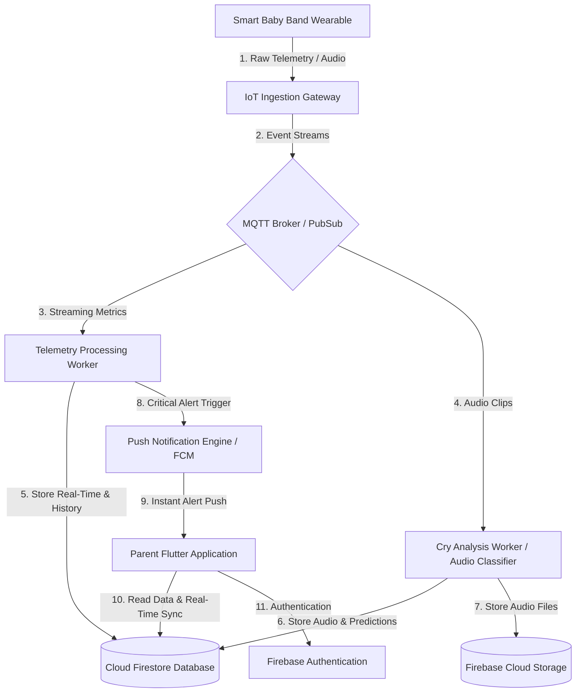

# Smart Baby Band Backend Architecture & Roadmap

This document outlines a complete backend architecture, database schema, and chronological roadmap tailored to support the existing **Smart Baby Band** Flutter application.

---

## 1. System Architecture Overview

The Smart Baby Band requires a backend capable of handling real-time streams of telemetry data (heart rate, body temperature, room conditions) from a physical wearable IoT device, processing audio inputs for cry detection, persistent data storage, parent notification systems, and secure authentication.



---

## 2. Firestore Database Schema Design

This schema is designed to map directly to the variables, tabs, and dashboards configured in the Flutter frontend.

### `users` Collection
Stores user account profiles, baby association records, and app configurations.
* **Path**: `/users/{userId}`
* **Document Fields**:
  ```json
  {
    "name": "string",
    "email": "string",
    "babyName": "string",
    "babyPhotoUrl": "string | null",
    "createdAt": "timestamp",
    "planType": "string",
    "settings": {
      "pushNotifications": "boolean",
      "alertVolume": "float",
      "vibrationAlerts": "boolean",
      "autoSync": "boolean",
      "shareBabyData": "boolean",
      "temperatureUnit": "string",
      "distanceUnit": "string",
      "language": "string",
      "alertThresholds": {
        "maxHeartRate": "integer",
        "minHeartRate": "integer",
        "maxTemperature": "float",
        "minTemperature": "float",
        "crySensitivity": "string"
      }
    }
  }
  ```

### `health_metrics` Subcollection
Keeps the latest real-time health and environment telemetry.
* **Path**: `/users/{userId}/health_metrics/latest`
* **Document Fields**:
  ```json
  {
    "temperature": "float",
    "heartRate": "integer",
    "sleepStatus": "string",
    "cryStatus": "string",
    "roomTemperature": "float",
    "humidity": "float",
    "lastUpdated": "timestamp"
  }
  ```

### `temperature_history` Subcollection
Logs historical body temperature scans to populate the 24-hour area chart and heatmap.
* **Path**: `/users/{userId}/temperature_history/{historyId}`
* **Document Fields**:
  ```json
  {
    "timestamp": "timestamp",
    "value": "float",
    "status": "string"
  }
  ```

### `heartrate_history` Subcollection
Stores high-resolution heart rate logs for the live trend, sparklines, zones, and distribution charts.
* **Path**: `/users/{userId}/heartrate_history/{historyId}`
* **Document Fields**:
  ```json
  {
    "timestamp": "timestamp",
    "value": "integer",
    "status": "string"
  }
  ```

### `cries` Subcollection
Stores cry events classified by duration, intensity, and cause to populate the Cry History dashboard.
* **Path**: `/users/{userId}/cries/{cryId}`
* **Document Fields**:
  ```json
  {
    "timestamp": "timestamp",
    "reason": "string",
    "durationSeconds": "integer",
    "intensity": "integer"
  }
  ```

### `sleep_history` Subcollection
Maintains daily sleep session logs to populate the Sleep summary, stages, and statistics.
* **Path**: `/users/{userId}/sleep_history/{dateId}`
* **Document Fields**:
  ```json
  {
    "date": "string",
    "totalDurationMinutes": "integer",
    "sleepQuality": "integer",
    "bedTime": "timestamp",
    "wakeTime": "timestamp",
    "stages": {
      "deepMinutes": "integer",
      "lightMinutes": "integer",
      "remMinutes": "integer"
    },
    "pattern": [
      {
        "time": "timestamp",
        "depth": "integer"
      }
    ]
  }
  ```

### `notifications` Subcollection
Logs alert histories (such as critical high heart rate incidents) triggered by backend workers.
* **Path**: `/users/{userId}/notifications/{notificationId}`
* **Document Fields**:
  ```json
  {
    "timestamp": "timestamp",
    "type": "string",
    "metric": "string",
    "value": "string",
    "status": "string",
    "isRead": "boolean"
  }
  ```

---

## 3. Chronological Backend Roadmap

```
Phase 1: Foundation & Auth ──► Phase 2: Ingestion & Storage ──► Phase 3: Analytics & ML ──► Phase 4: Push Alerts ──► Phase 5: Production & Ops
```

### Phase 1: Foundation & User Authentication
**Objective**: Build a secure base for user identity and configurations.

* **Task 1.1: Firebase Project Provisioning**
  * Create Firebase environment stages (development, staging, production).
  * Configure Firebase iOS and Android clients within the Flutter codebase using `firebase_core`.
* **Task 1.2: Authentication Rules & Validation**
  * Implement registration and login backend logic (handled via Firebase Auth inside the client).
  * Configure password policies and email verification.
* **Task 1.3: User Collection Setup**
  * Initialize the `/users` collection structure.
  * Define Firestore Security Rules to restrict document read/write actions strictly to authenticated owners:
    ```javascript
    rules_version = '2';
    service cloud.firestore {
      match /databases/{database}/documents {
        match /users/{userId}/{document=**} {
          allow read, write: if request.auth != null && request.auth.uid == userId;
        }
      }
    }
    ```
* **Task 1.4: Syncing Preferences & Settings**
  * Wire the local configurations from `/settings` to upload state changes automatically back to `/users/{userId}`.

---

### Phase 2: IoT Telemetry Ingestion & Storage Pipeline
**Objective**: Create high-throughput streaming channels to collect and organize baby sensor telemetry.

* **Task 2.1: IoT Communication Protocol Selection**
  * **Option A (Low-power/Standard)**: Set up an **MQTT Broker** (e.g., HiveMQ, EMQX, or AWS IoT Core) to handle constant lightweight publishing of body temperature and heart rate logs.
  * **Option B (Serverless/Quick deployment)**: Deploy serverless REST HTTP cloud functions to accept regular POST requests containing JSON packages from the band.
* **Task 2.2: Telemetry Ingestion Worker**
  * Write a background service (Node.js or Python) that subscribes to incoming data streams, parses values, and updates `/users/{userId}/health_metrics/latest`.
* **Task 2.3: Data Aggregation & History Compaction**
  * Write a scheduler function (running every 5 or 10 minutes) that batches raw real-time records into `/temperature_history` and `/heartrate_history` subcollections.
  * This limits Firestore write operations and keeps the mobile client's charts responsive by reading consolidated data blocks.

---

### Phase 3: Sleep Tracking & Cry Classification Analytics
**Objective**: Add intelligence to detect when a baby is crying, determine why, and track sleep quality.

* **Task 3.1: Sleep Stage Calculation Engine**
  * Write a state tracking algorithm based on movement (accelerometer) and heart rate variations (BPM).
  * Compute sleep quality percentages and differentiate sleep states (Deep, Light, REM) to build daily records inside `/sleep_history`.
* **Task 3.2: Cry Classification Pipeline**
  * When the band detects high volume or sound frequencies, it captures an audio clip.
  * Upload the raw audio (WAV/M4A) to a designated Firebase Cloud Storage bucket.
  * Trigger a serverless cloud function to feed the audio waveform to a classification model (e.g., a CNN trained on cry datasets).
  * The model outputs a prediction label (Hunger, Sleepy, Discomfort, Need Burping, or Other) and posts it directly into the `/cries` subcollection.
* **Task 3.3: Real-Time State Broadcasts**
  * Send immediate state changes (`crying`, `awake`, `sleeping`) down to the Dashboard live indicator cards.

---

### Phase 4: Emergency Alert Engine & Push Notifications
**Objective**: Ensure parents receive instant push notifications for critical readings, linking directly to the Emergency Alert UI screen.

* **Task 4.1: Threshold Evaluation Worker**
  * Build a low-latency alert evaluator that processes incoming telemetry values.
  * Compare the values against user thresholds defined in `/users/{userId}/settings/alertThresholds` (e.g., Temperature > 37.5°C or Heart Rate > 150 BPM).
* **Task 4.2: Firebase Cloud Messaging (FCM) Integration**
  * Set up FCM credentials and register device push tokens during parent logins.
  * Build a notification sender using cloud functions to send high-priority push payloads directly to the parent's phone.
  * Deliver standard data packets containing:
    ```json
    {
      "to": "parent_device_token",
      "priority": "high",
      "notification": {
        "title": "Emergency Alert",
        "body": "Liam's heart rate has exceeded 150 BPM!"
      },
      "data": {
        "click_action": "FLUTTER_NOTIFICATION_CLICK",
        "route": "/notifications",
        "metric": "Heart rate",
        "value": "150 bpm",
        "status": "Too High"
      }
    }
    ```
* **Task 4.3: In-App Broadcasts & Audio Alert Override**
  * Configure the Flutter application to receive these message packets, immediately routing to the `NotificationsPage` and playing critical warnings (ignoring phone silent mode if permissible).

---

### Phase 5: Production Readiness, Security & Operations
**Objective**: Secure data streams, scale infrastructure, and enforce health-data compliance rules.

* **Task 5.1: Health Data Security & HIPAA Considerations**
  * Because the system tracks pediatric biometrics, implement data encryption in transit (TLS 1.3) and at rest.
  * Establish clear policies regarding pediatric diagnostic claims, ensuring the application is categorized as a general wellness tracker rather than a certified medical device to comply with app store guidelines.
* **Task 5.2: Automated DB Pruning & TTL (Time-To-Live)**
  * Telemetry history accumulates high volumes. Set up TTL policies in Firestore to auto-delete high-resolution raw telemetry data older than 30 days while preserving consolidated daily averages.
* **Task 5.3: Pediatrician Data Sharing Interface**
  * Create a secure endpoint that generates time-limited read-only access URLs, fulfilling the "Share Baby Data" toggle feature.
* **Task 5.4: Logging, Monitoring & Health Check Systems**
  * Set up logging and tracking (e.g., using Datadog, Sentry, or Google Cloud Operations Suite) to monitor real-time latency, IoT broker drops, and ML model inference errors.
